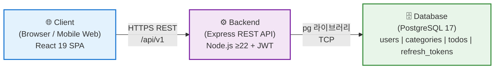
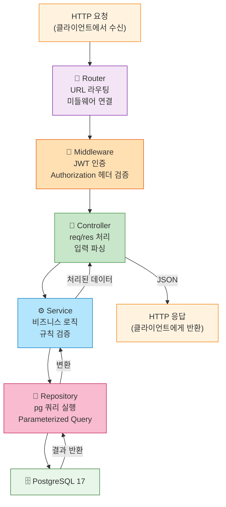
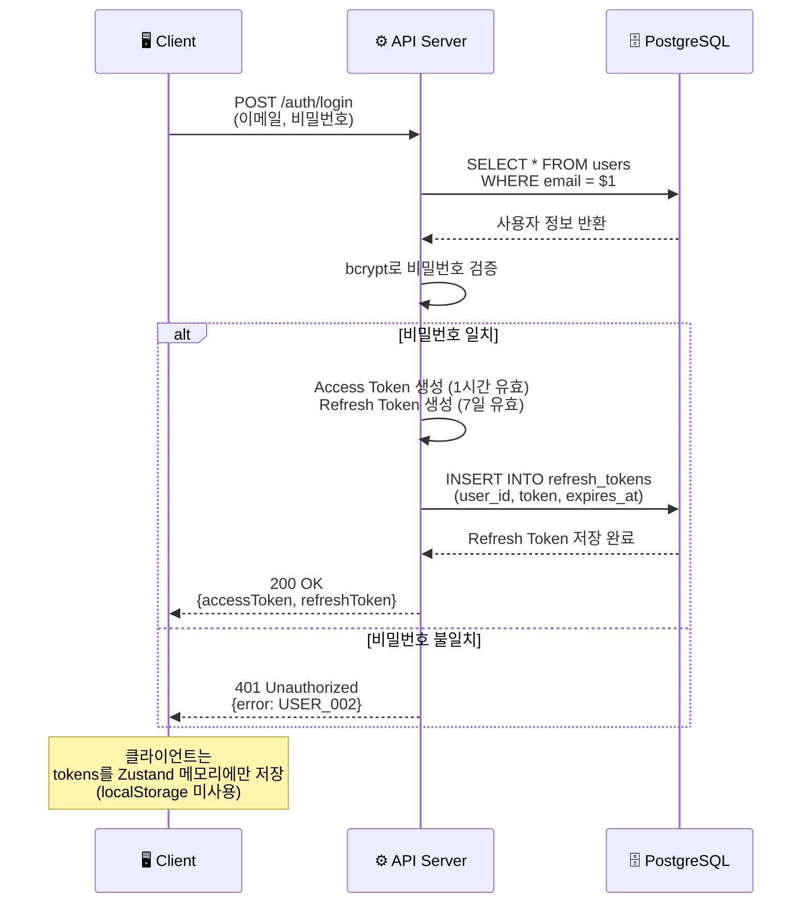

# TodoListApp 기술 아키텍처 다이어그램

**문서 버전**: 1.0  
**작성일**: 2026-05-13  
**작성자**: 개발팀  
**참조 문서**: [PRD](./2-prd.md) · [프로젝트 구조](./4-project-structure.md)

---

## 변경 이력

| 버전 | 일자 | 작성자 | 변경 내용 |
|------|------|--------|-----------|
| 1.0 | 2026-05-13 | 개발팀 | 최초 작성 |
| 1.1 | 2026-05-14 | 개발팀 | 실제 구현 기준으로 문서 보정 — Express 5.x, 로그인 응답 camelCase 필드명 (`accessToken`, `refreshToken`) |

---

## 다이어그램 1: 전체 시스템 구조

**설명**: TodoListApp의 3계층 아키텍처. 클라이언트는 HTTPS REST API를 통해 백엔드와 통신하며, 백엔드는 pg 라이브러리로 PostgreSQL 17에 접근한다.

---

## 다이어그램 2: 백엔드 레이어 구조

**설명**: HTTP 요청이 라우터, 미들웨어, 컨트롤러, 서비스, 저장소를 거쳐 PostgreSQL에 도달하는 단방향 흐름. 각 레이어는 명확한 책임을 가진다.

---

## 다이어그램 3: 인증 흐름 (로그인 기준)

**설명**: 클라이언트가 이메일/비밀번호로 로그인 요청 후, 서버가 Refresh Token을 DB에 저장하고 Access Token + Refresh Token을 반환하는 시퀀스 다이어그램.

---

## 기술 스택 상세

| 계층 | 기술 | 용도 |
|------|------|------|
| **프론트엔드** | React 19 + TypeScript 5.x + Zustand + TanStack Query v5 + Vite | SPA 반응형 웹 (PC, 모바일) |
| **백엔드** | Node.js ≥22 + Express 5.x | REST API 서버 (/api/v1) |
| **데이터베이스** | PostgreSQL 17 | 사용자, 할일, 카테고리, 토큰 저장 |
| **인증** | JWT (Access Token + Refresh Token) | 무상태 사용자 인증 |
| **보안** | bcrypt (salt rounds: 12) | 비밀번호 해싱 |
| **DB 드라이버** | pg (PostgreSQL client) | Parameterized Query 기반 DB 접근. ORM(Prisma, TypeORM 등) 사용 금지 |

---

## 핵심 설계 원칙

### 1. 레이어 분리
- **프론트엔드**: 컴포넌트 → 훅 → API 클라이언트 (단방향 의존성)
- **백엔드**: 라우터 → 컨트롤러 → 서비스 → 저장소 (단방향 의존성)

### 2. 데이터 흐름
- DB 컬럼명: `snake_case` (PostgreSQL 관례)
- JS/TS 코드: `camelCase` (JavaScript 관례)
- 변환 위치: 저장소 레이어 (백엔드), API 클라이언트 (프론트엔드)

### 3. 보안
- SQL Injection 방지: Parameterized Query 필수 (`pg` 라이브러리)
- CORS: 환경 변수로 관리 (하드코딩 금지)
- JWT: Access Token (1시간) + Refresh Token (7일, DB 저장)

### 4. 데이터 격리
- 모든 API는 JWT를 통해 `userId` 검증
- 사용자는 자신의 데이터에만 접근 가능 (서버 측 강제)
