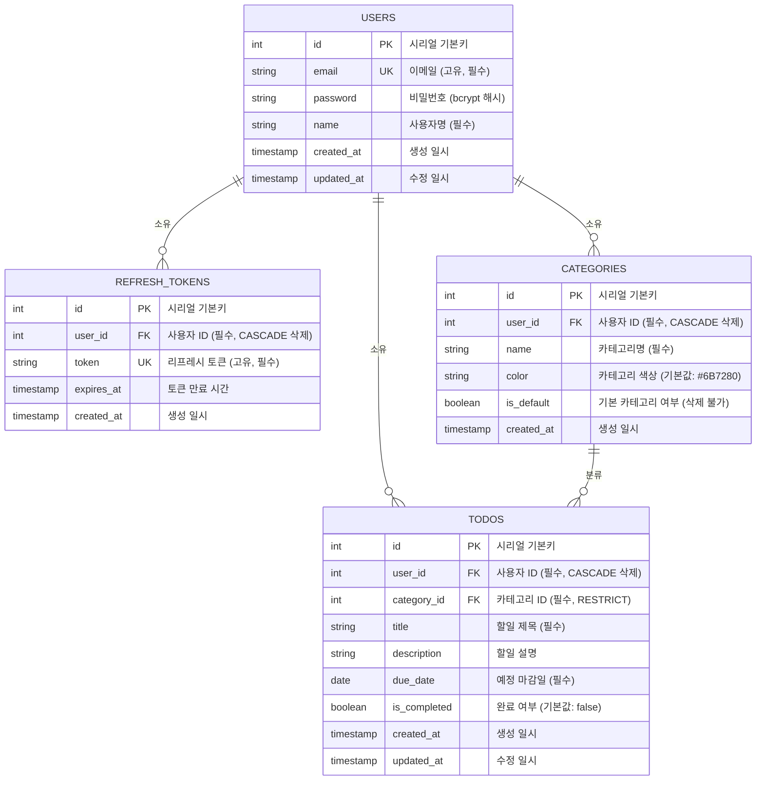

# 개체-관계 다이어그램 (ERD)

**문서 버전:** 1.0  
**작성일:** 2026-05-13  
**참조 문서:** [`./2-prd.md`](./2-prd.md)  
**작성자:** kim tae wan  

---

## 변경 이력

| 버전 | 날짜 | 변경 사항 | 작성자 |
|------|------|---------|-------|
| 1.0 | 2026-05-13 | 초기 ERD 문서 작성 | kim tae wan |

---

## 개요

본 ERD는 할일 관리 애플리케이션의 데이터 모델을 시각화합니다. 사용자 인증, 할일 관리, 카테고리 분류를 중심으로 설계되었습니다.

---

## Entity-Relationship Diagram



---

## 테이블 정의서

### 1. USERS (사용자)

| 컬럼명 | 타입 | 제약 조건 | 설명 |
|--------|------|---------|------|
| id | SERIAL | PK | 사용자 고유 식별자 |
| email | VARCHAR(255) | UK, NOT NULL | 사용자 이메일 (고유) |
| password | VARCHAR(255) | NOT NULL | bcrypt로 해시된 비밀번호 |
| name | VARCHAR(100) | NOT NULL | 사용자 이름 |
| created_at | TIMESTAMPTZ | DEFAULT NOW() | 계정 생성 일시 |
| updated_at | TIMESTAMPTZ | DEFAULT NOW() | 프로필 수정 일시 |

**비즈니스 규칙:**
- email은 시스템에서 유일해야 함
- password는 반드시 bcrypt로 해시하여 저장
- created_at과 updated_at은 자동으로 관리됨

---

### 2. REFRESH_TOKENS (리프레시 토큰)

| 컬럼명 | 타입 | 제약 조건 | 설명 |
|--------|------|---------|------|
| id | SERIAL | PK | 토큰 고유 식별자 |
| user_id | INTEGER | FK (USERS.id), NOT NULL | 토큰 소유 사용자 |
| token | TEXT | UK, NOT NULL | JWT 리프레시 토큰 값 |
| expires_at | TIMESTAMPTZ | NOT NULL | 토큰 만료 시간 |
| created_at | TIMESTAMPTZ | DEFAULT NOW() | 토큰 발급 일시 |

**비즈니스 규칙:**
- token 값은 고유해야 함
- user_id가 삭제되면 CASCADE로 자동 삭제
- expires_at 이후의 토큰은 사용 불가능
- 동일 사용자가 여러 토큰 발급 가능 (다중 디바이스 로그인 지원)

---

### 3. CATEGORIES (카테고리)

| 컬럼명 | 타입 | 제약 조건 | 설명 |
|--------|------|---------|------|
| id | SERIAL | PK | 카테고리 고유 식별자 |
| user_id | INTEGER | FK (USERS.id), NOT NULL | 카테고리 소유 사용자 |
| name | VARCHAR(100) | NOT NULL | 카테고리명 |
| color | CHAR(7) | DEFAULT '#6B7280' | 카테고리 색상 (HEX 코드) |
| is_default | BOOLEAN | DEFAULT FALSE | 기본 카테고리 여부 |
| created_at | TIMESTAMPTZ | DEFAULT NOW() | 생성 일시 |

**비즈니스 규칙:**
- is_default가 TRUE인 카테고리는 삭제 불가
- user_id가 삭제되면 CASCADE로 자동 삭제
- 각 사용자는 최소 1개의 기본 카테고리 보유
- color는 '#RRGGBB' 형식의 HEX 코드

---

### 4. TODOS (할일)

| 컬럼명 | 타입 | 제약 조건 | 설명 |
|--------|------|---------|------|
| id | SERIAL | PK | 할일 고유 식별자 |
| user_id | INTEGER | FK (USERS.id), NOT NULL | 할일 소유 사용자 |
| category_id | INTEGER | FK (CATEGORIES.id), NOT NULL | 할일 분류 카테고리 |
| title | VARCHAR(200) | NOT NULL | 할일 제목 |
| description | TEXT | NULL | 할일 상세 설명 |
| due_date | DATE | NOT NULL | 예정 마감일 |
| is_completed | BOOLEAN | DEFAULT FALSE | 완료 여부 |
| created_at | TIMESTAMPTZ | DEFAULT NOW() | 생성 일시 |
| updated_at | TIMESTAMPTZ | DEFAULT NOW() | 수정 일시 |

**비즈니스 규칙:**
- category_id는 필수 (모든 할일은 카테고리에 속해야 함)
- due_date는 필수 (마감일이 있어야 함)
- is_completed는 기본값이 FALSE
- user_id가 삭제되면 CASCADE로 자동 삭제
- category_id가 삭제되는 경우 애플리케이션에서 사전에 할일을 다른 카테고리로 이전한 후 삭제

---

## 관계 설명

| 관계 | 카디널리티 | 유형 | 설명 |
|------|-----------|------|------|
| USERS → REFRESH_TOKENS | 1:N | ON DELETE CASCADE | 사용자 1명은 여러 개의 리프레시 토큰을 소유할 수 있음. 사용자 삭제 시 모든 토큰도 삭제됨 |
| USERS → CATEGORIES | 1:N | ON DELETE CASCADE | 사용자 1명은 여러 개의 카테고리를 소유할 수 있음. 사용자 삭제 시 모든 카테고리도 삭제됨 |
| USERS → TODOS | 1:N | ON DELETE CASCADE | 사용자 1명은 여러 개의 할일을 소유할 수 있음. 사용자 삭제 시 모든 할일도 삭제됨 |
| CATEGORIES → TODOS | 1:N | RESTRICT | 카테고리 1개는 여러 개의 할일을 분류할 수 있음. 카테고리 삭제 시 해당 카테고리의 할일을 다른 카테고리로 이전한 후 삭제 가능 |

---

## 주요 설계 결정사항

### 1. 다중 테넌트 설계
- 모든 주요 테이블(categories, todos, refresh_tokens)에 `user_id` 포함
- 데이터 격리: 각 사용자는 자신의 데이터에만 접근 가능

### 2. 데이터 무결성
- **CASCADE 삭제:** 사용자 삭제 시 관련 모든 데이터 자동 삭제
- **RESTRICT 삭제:** 카테고리 삭제 시 먼저 할일 이전 필요 (비즈니스 로직에서 처리)
- **NOT NULL 제약:** 카테고리와 마감일은 필수

### 3. 인증 및 토큰
- 리프레시 토큰을 별도 테이블로 관리 (다중 디바이스 로그인 지원)
- 토큰 만료 시간 관리로 보안 강화

### 4. 타임스탐프
- 모든 테이블에 `created_at` 포함 (감시, 감사 추적용)
- 사용자 프로필 및 할일은 `updated_at`도 포함 (수정 이력 추적)

### 5. 기본 카테고리
- is_default 플래그로 기본 카테고리 표시
- 기본 카테고리는 삭제 불가능 (비즈니스 로직에서 강제)

---

## 인덱스 권장사항

```sql
-- 성능 최적화를 위한 권장 인덱스
CREATE INDEX idx_refresh_tokens_user_id ON refresh_tokens(user_id);
CREATE INDEX idx_refresh_tokens_expires_at ON refresh_tokens(expires_at);

CREATE INDEX idx_categories_user_id ON categories(user_id);

CREATE INDEX idx_todos_user_id ON todos(user_id);
CREATE INDEX idx_todos_category_id ON todos(category_id);
CREATE INDEX idx_todos_due_date ON todos(due_date);
CREATE INDEX idx_todos_is_completed ON todos(is_completed);
```

---

## 정규화 검토

- **1NF (제1정규형):** 모든 속성이 원자적 값 ✓
- **2NF (제2정규형):** 부분 종속 없음 ✓
- **3NF (제3정규형):** 이행 종속 없음 ✓

---

## 참고 사항

- 모든 날짜/시간 필드는 TIMESTAMPTZ 또는 DATE 타입 사용
- 데이터베이스는 PostgreSQL 17 기준
- 본 ERD는 [`./2-prd.md`](./2-prd.md)의 7.2절 테이블 정의를 기반으로 작성됨
