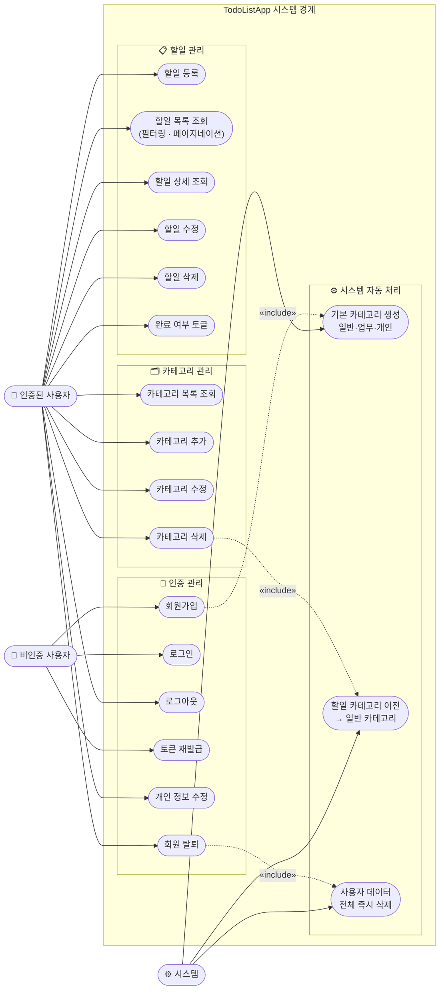

# TodoListApp 유스케이스 다이어그램

**참조 문서**: [PRD](./2-prd.md) · [도메인 정의서](./1-domain-definition.md)

---

---

## 액터 정의

| 액터 | 설명 |
|------|------|
| **비인증 사용자** | 회원가입 또는 로그인 전 상태. 인증 관련 유스케이스만 접근 가능 |
| **인증된 사용자** | JWT 로그인 완료 상태. 모든 도메인 유스케이스 접근 가능 |
| **시스템** | 사용자 액션에 의해 자동으로 실행되는 내부 처리 주체 |

## 관계 설명

| 관계 | 대상 | 설명 |
|------|------|------|
| `«include»` | 회원가입 → 기본 카테고리 생성 | 가입 성공 시 반드시 실행 |
| `«include»` | 카테고리 삭제 → 할일 카테고리 이전 | 삭제 전 소속 할일을 `일반`으로 이전 후 삭제 |
| `«include»` | 회원 탈퇴 → 데이터 전체 삭제 | 탈퇴 시 모든 할일·카테고리·토큰 즉시 삭제 |
